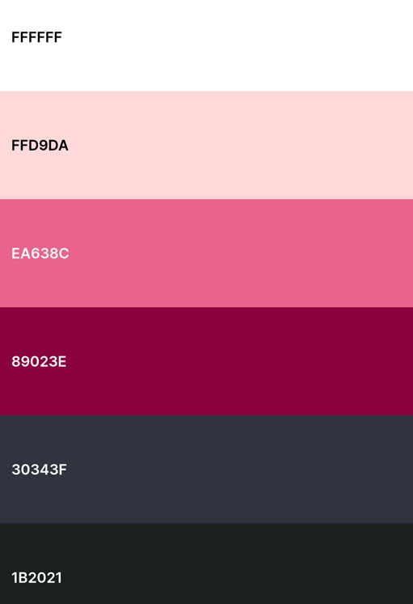
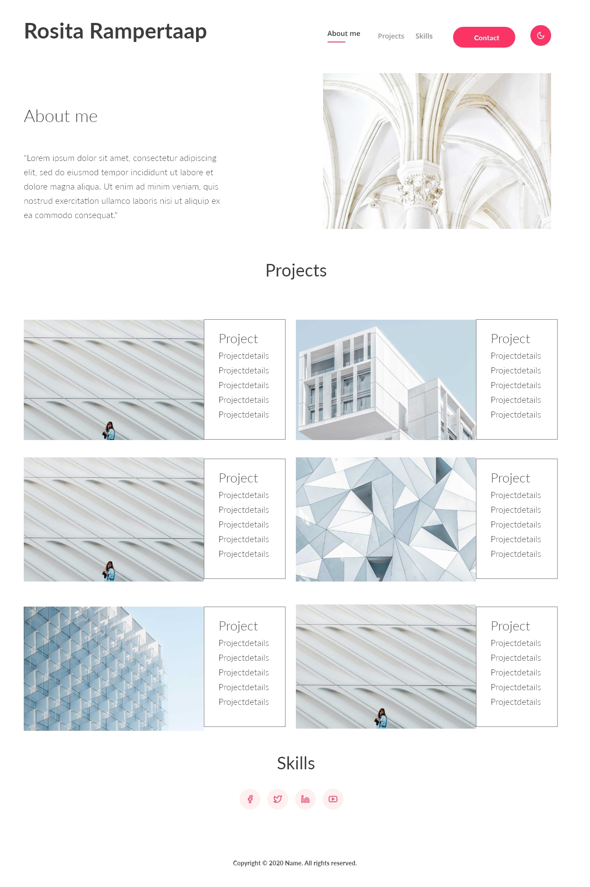
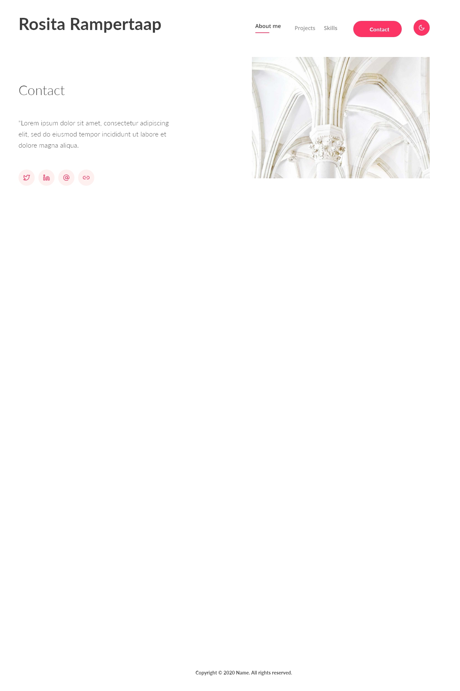

# Portfolio website 

I am Rosita, a Front-Enddeveloper from the Netherlands and currently learning the [Front-End Engineer Career Path on Codecademy.com](https://www.codecademy.com/learn/paths/front-end-engineer-career-path). I am learning to code every single day. as I am writing this, it's day: 451.

In this README file I am keeping track of the progress of building this website. I am building this portfolio because it's good to have place where you can show your skills and this is also [a project from Codecademy](https://www.codecademy.com/paths/front-end-engineer-career-path/tracks/fecp-html-css-and-js-portfolio-project/modules/fecp-personal-portfolio-website/kanban_projects/portfolio-website)

## Project Objectives
* Build a website using HTML, CSS
* Add at least one interactive feature using JavaScript
* Use Git version control
* Use the command line and file navigation
* Develop locally on your computer
* Deploy your site to the web using GitHub Pages

## Prerequisites:
* HTML/CSS
* JavaScript
* Git and GitHub
* Command line and file navigation

## The plan
Build a website with HTML and CSS an a bit of Javascript. For the JS part I am thinking of building a simple darkmode. 

The website wil contain:
* a header with My name in it , a menu with links to various parts of my portfolio.
* a main section with information about me, a picture of me, a list with projects I have done, My skills and languages.
* a small footer
* a simple contact page

For the layout I'll use the same layout as Codecademy's sample project for now. 

### Fonts (Google Fonts):
* Title: Architects Daughter
* Heading: Source Code Pro (Semi-bold 600)
* Body: Poppins (Regular 400)

### Colors:
* Main backgroundcolor: #ffffff: White
* Accent color 1: #ED7D9F: Cyclamen
* Accent color 2: #AC024E: Amaranth Purple
* Main backgroundcolor darkmode: #1B2021: Eerie Black
* Accent color 1 darkmode: #FFD9DA: Pale Pink
* Accent color 2 darkmode: #30343F: Gunmetal

### Fontsizes:
* Title(H1): 50px
* H2: 40px
* H3 30px
* Body: 20px

I'll use Icons from Font Awesome.

## Project steps overview according the project on Codecademy.com
### Plan your project (6/6/2021) 
For me this is the hardest to do, because I am not well at planning. I am going to spend a week to do each step and i'll adjust the plan if needed. 
Except for this stem. Today I have written down my plans in this README file and created a repository on [GitHub](https://github.com/Rosita311/portfolio) , so that I can keep all the info on GitHub.

### Wireframe your website (start 7/6/2021)
I would like to use Adobe XD to Wireframe my website. If this does not work, i'll use paper and a pencil. I am reading and using a [Tutorial about Adobe XD](https://www.adobe.com/products/xd/learn/design/productivity/how-to-wireframe-xd.html) to learn more about Adobe XD and make the wireframe. 

I made a Wireframe in Adobe XD, but I still don't know how it works. Elements I made are suddenly removed or there are duplicate elements, but it's pretty hard. I made a wireframe for the homepage. it's almost finished and after that, I'll make one for the contactpage. If it doesn't work out, I'll use pen and paper. 

I made a somewhat fancy Wireframe in Adobe XD. It's not a perfect Wireframe but it does the job. The images are too large, but that's ok. 

### Create files and deploy it Locally (start 8/6/2021)
After I made the Wireframes, I created 2 HTML files, 1 CSS file and a JS file (using Git). I'll add images for my portfolio sometime later. 

### Version control (Start 8/6/2021)
I imediately pushed everything to GitHub. It's not the first time i have lost my code somehow. On GitHub it's save. Now I am ready for the fun part! 

### Build the Home Page (start 9/6/2021)
Today I built the homepage in HTML. I also added pictures of all the projects, Icons, Font Awesome CDN and Google Fonts CDN.

### Build the Contact Page (start 10/6/2021)
I made the contactpage. I copied the header, the footer and one section from the homepage and I changed the content. This is the first time I am building a website with more than one page. 

### Style the content (start 11/6/2021)
Styling two pages with one css file is harder than I thought. The first section on the homepage has the same layout as the contact page and still the picture won't move next to the text. 

And I messed up the columns for the projects section. [Now I have found something that should work.](https://dev.to/drews256/ridiculously-easy-row-and-column-layouts-with-flexbox-1k01)

Two days later I finished the homepage! There's just one minor thing I'd like to have the borders in the header and the footer fullwidth, but I don't know yet how to do that.

I also finished the contactpage. I'll add responsiveness later. 

### Make it interactive (start 15/6/2021)
I add the darkmode. with CSS variables and Javascript. I used this [tutorial](https://www.youtube.com/watch?v=RiWxhm5ZdFM&t=34s) for some explanation, but I really could understand what was told. 
Adding the darkmode was pretty easy. So I added a counter too! That wasn't easy even with the example portfolio from Codecodemy. I was confused with the starting date. But I think it's fixed now. 

### Make it responsive (start 16/6/2021)
Today I made my website responsive. That wasn't that hard most of the time. 
* I only had a hard time implementing Flex (Flex grow, Flex shrink and Flex basis), I added another flex selector to .column to adjust the columns on mobile.
* I also used fit-content to adjust the height of the projectblocks, since the layout has changed for mobile. I replaced it with auto. Fit-content isn't supported in Firefox.
* The counter didn't work in Firefox, I changed the date notation from '03-12-2020' to '2020-03-12'.
* I fixed the footer to the bottom of the contactpage. 
* And I also made the website accessible for people with visual impairments. Accessibility is a very important topic to me. 

### Publish to the web (start 16/6/2021)
I published the website to GitHub pages a few days ago. So I could get help.
A big thanks to everyone who has helped me! 